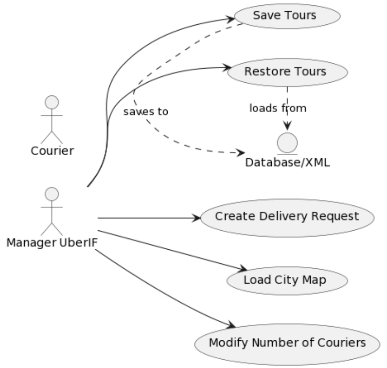

# Agile

## First Iteration Report

### Table of Contents

1. [Use Case Diagram](#1-use-case-diagram)
2. [Description of the main success scenario of all identified use cases](#2-description-of-the-main-success-scenario-of-all-identified-use-cases)
3. [Class and Package Diagrams](#3-class-and-package-diagrams)
4. [State-Transition Diagram](#4-state-transition-diagram)
5. [Plannings of the different iterations](#5-plannings-of-the-different-iterations)
6. [Architectural and Design Patterns choices](#6-architectural-and-design-patterns-choices)
7. [Why JUNIT?](#7-why-junit)
8. [Discussion on Social and Environmental Issues related to the application](#8-discussion-on-social-and-environmental-issues-related-to-the-application)
9. [Technical and Human Review](#9-technical-and-human-review)
10. [Glossary](#10-glossary)

## 1. Use Case Diagram

Here's the use case diagram for our application:



## 2. Description of the main success scenario of all identified use cases

| USE CASE                  | Main Success Scenario                                                                                                                                                                                                                                                                                                                                   |
| ------------------------- |---------------------------------------------------------------------------------------------------------------------------------------------------------------------------------------------------------------------------------------------------------------------------------------------------------------------------------------------------------|
| Create Delivery Request   | 1. Manager chooses a courier<br>2. Manager selects an intersection and enters a time window<br>3. System checks and validates data<br>4. System creates the delivery request<br>5. System initiates the process of finding the best tour for the chosen courier. If the tour is feasible, the directions are printed in a PDF document for the courier. |
| Load City Map             | 1. Manager selects another city map to load in the dropdown list. By default, the small map is loaded. <br>2. System gets all the necessary information from an XML file<br>3. System display successfully the map                                                                                                                                      |
| Modify Number of Couriers | 1. Manager clicks on “+” or “-” to modify the number of available couriers. If they click on "+", they enter the name of the new courier. If they click on "-", the last courier added is removed. <br>2. System adjusts the number of couriers                                                                                                         |
| Save Tours                | 1. Manager clicks on saving the tours running at the moment<br>2. System saves tour details to an XML file<br>3. System acknowledges successful saving of the tour                                                                                                                                                                                      |
| Restore Tours             | 1. Manager clicks on restoring the tours<br>2. Manager chooses the tours they want to restore<br>3. System retrieves and displays the selected tour details                                                                                                                                                                                             |

## 3. Class and Package Diagrams

## 4. State-Transition diagram

## 5. Plannings of the different iterations

### a. Sprint 1 Review
#### Initial Planning

#### Actual Planning

- Being able to load the map of intersections with the file given at the beginning
- Being able to display the best route
- Change the number of couriers
- Entering and managing delivery requests within the right time window

### b. Sprint 2 Review
#### Initial Planning
#### Actual Planning

- Add new features: being able to add manually a delivery at an intersection that's not in the XML file given initially
- Telling the courier a road is not cyclable and he can't go deliver by this road

### c. Sprint 3 Review
#### Initial Planning
#### Actual Planning


## 6. Architectural and Design Patterns choices
The application employs the Model-View-Controller (MVC) architecture, pro- viding several advantages:


**Separation of Concerns:** MVC divides the application into three main components—Model, View, and Controller—facilitating ease of mainte- nance and code evolution.

**Ease of Maintenance:** Developers can work on individual components without affecting others. For example, UI design changes do not impact business logic.

**Parallel Development:** Teams can work simultaneously on different components, accelerating development.

**Code Reusability:** Models can often be reused across different views, and views with different controllers.

**Ease of Testing:** Clear separation simplifies unit testing and debugging. Components can be tested independently.

**Data Presentation Flexibility:** The separation allows the same data to be presented in different ways, useful for applications requiring diverse UIs.

**Adaptability and Scalability:** MVC provides flexibility to evolve and adapt the application to changing needs without a complete overhaul.

**Complex Interaction Handling:** Efficient management of complex in- teractions between UI and business logic, crucial for modern web applica- tions.

## 7. Why JUNIT?

For unit testing, we will use JUnit, Mockito, and JFixture. Here is a simplified example of a unit test in Java using JFixture for test data generation and Mockito for mocking dependencies:

**Example for the classes:**

```java

public class UserService {
    private UserRepository userRepository;

    public UserService(UserRepository userRepository) {
        this.userRepository = userRepository;
    }

    public User getUserById(String userId) {
        return userRepository.findById(userId);
    }
}

public interface UserRepository {
    User findById(String userId);
}

public class User {
    private String id;
    private String name;
    // Getters, setters, etc.
}
```

**Example of Unitary Tests:**

```java
    import static org.mockito.Mockito.*;
import static org.junit.Assert.*;
import org.junit.Before;
import org.junit.Test;
import com.flextrade.jfixture.JFixture;

public class UserServiceTest {

    private UserRepository userRepositoryMock;
    private UserService userService;
    private JFixture fixture;
    private String userId;
    private User expectedUser;

    @Before
    public void setUp() {
        // Creation of a mock for UserRepository
        userRepositoryMock = mock(UserRepository.class);

        // Initialisation of UserService with the mock
        userService = new UserService(userRepositoryMock);

        // Initialisation of JFixture for the data generation
        fixture = new JFixture();

        // Creation of a user ID and of a User object
        userId = fixture.create(String.class);
        expectedUser = fixture.create(User.class);

        // Configuration of the behaviour of the mock
        when(userRepositoryMock.findById(userId)).thenReturn(expectedUser);
    }

    @Test
    public void getUserById_ShouldReturnUser() {
        // Action: Calling of the method to test
        User result = userService.getUserById(userId);

        // Checking: Result must correspond to expected User Object
        assertEquals(expectedUser, result);

        // Checking that the mock has been called as expected
        verify(userRepositoryMock).findById(userId);
    }
}
```
In this example, JFixture is used for automatic instance creation, and Mock- ito for mocking UserRepository and configuring its behavior. The test verifies that userService.getUserById returns the expected User object and that the mock repository is called correctly.

## 8. Discussion on social and environmental issues related to the application

Using bicycles for urban delivery services is a great step towards addressing both social and environmental issues. Indeed, it can not only reduce urban congestion, but also contribute to reduced delivery times, which makes it more efficient overall. However, it's also important to take a look at negative impacts it could have.

Let's start with the positive sides of using our application. Firstly, it creates employment opportunities for people who know how to bike. As talked about just above, it promotes a greener and cleaner urban environment. In fact, it promotes an eco-friendly mode of transport, which prompts cities to improve their cycling infrastructure. This will then lead to a more environmentally friendly urban landscape, and a fight against both climate change and air pollution.

Another key point of the application is that it's open sourec, which allows everybody to correct it and improve it if needed, for instance to make it more accessible and ergonomic. This would also help to spread the concept in other cities.

Finally, this could help people that can't do their groceries, whether it's because of a lack of time, or a lack of means, to have their products delivered directly at their home.

Nonetheless, our application could raise some important questions about the working conditions and rights of the couriers. Fair treatment and compensation should be at the heart of the discussions. What's more, even though accessibility should be considered in the app's design, for now, it excludes individuals with disabilities such as bad vision for instance. And the application can't be used by people who don't have credit cards or smartphones.

Sadly, this application brings the problem of increased consumption of single-use plastic, which is obviously not a good thing for our planet.

Lastly, one could say that this concept will definitely increase the price of products, making them less accessible for poor people.

## 9. Technical and Human Review
### Technical Review

Technically speaking, we haven't encountered a lot of problems in the three sprints we have made.

There are some features that we would have loved to implement, but that were too complicated. For instance, we would have liked to do more deliveries at the same time, or assign the courier to a delivery by computing who's the best one for this delivery, instead of choosing manually a courier before computing the road map.

Regarding the back-end language, we used Java. We think that this was a good language to use for the algorithms.

However, concerning the front-end language, we used JavaFX and it brought some problems such as the fact that it was harder to manipulate than HTML.

What's more, we separated the work into two teams: back-end and front-end team. This worked very well and we managed to work efficiently.

Nonetheless, we think that we could have worked differently regarding the management of the sprints. For instance, we should have implemented the use cases from the beginning to the end, and then improve it later on. Instead, we implemented multiple use cases at the same time, which isn't really Agile-like.

### Human Review

Regarding the human review, we loved working together. It was a great team and the mood was always good. 

Everybody was always motivated to work, even at 8 AM. The task repartition was also great and we worked evenly outside of class.


## 10. Glossary

- **_Application_**: The software system designed for optimizing delivery tours in cities using bicycles.
- **_City Map_**: A digital representation of a city's layout, including intersections and road segments, used for planning delivery tours.
- **_Intersection_**: A point where two or more roads meet in the city map, characterized by its geographical coordinates: latitude and longitude.
- **_Latitude:_** The geographic coordinate that specifies the north-south position of a point on the Earth's surface.
- **_Longitude:_** The geographic coordinate that specifies the east-west position of a point on the Earth's surface.
- **_Road Segment_**: A stretch of road connecting two intersections, with attributes like origin, destination, name, and length.
- **_XML File_**: A file format used to describe the city map, including details of intersections, road segments, and the warehouse address.
- **_Warehouse:_** The starting and ending point for courier tours, where deliveries are dispatched from.
- **_Courier:_** An individual responsible for carrying out deliveries on a bicycle.
- **_Delivery Request:_** An order for goods to be delivered on a bicycle to a specific location within a designated time window.
- **_Time-Window:_** A specified duration, in our case, one hour, within which a delivery must be made. Starts at fixed hours in the morning (8, 9, 10, or 11 a.m.).
- **_Tour:_** A sequence of deliveries assigned to a courier, including start and end times, delivery locations, and time windows.
- **_Tour Optimization:_** The process of determining the most efficient route for a courier to complete all assigned deliveries within their time window.
- **_Address:_** The specific location for delivery, typically including details like street name, number, city, and corresponding to latitude and longitude coordinates.
- **_Travel Speed:_** The assumed constant speed of the couriers, used for calculating tour duration and feasibility.
- **_Delivery Performance Time:_** The time taken to perform a delivery, assumed to be constant (e.g., 15 minutes).
- **_User:_** The person operating the application, responsible for loading maps, inputting delivery requests, and managing couriers. In our case, the user is the manager of UBER'IF.
