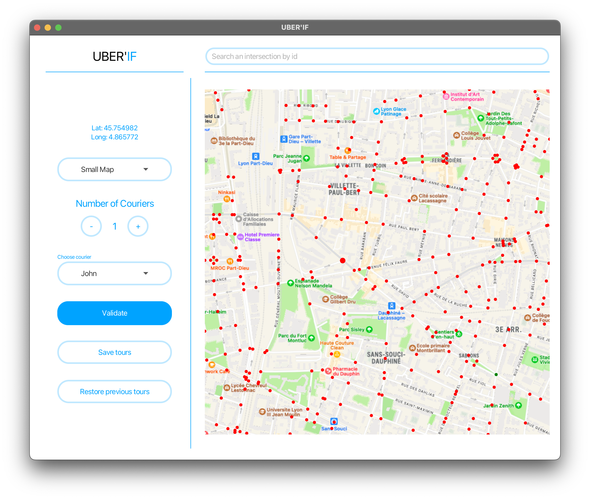

# User Manual of UBERIF

## Running the application

To run the application, the user only has to build compile, and run the .jar directory.

## OverView of the application

This is what our application looks like when the user (the manager) runs the application.

## Description of the features

Let's go over the different features from top to bottom, and from left to right.

### Search Intersection by ID

The first feature the manager has access to is searching an intersection by ID. For that, the manager needs to enter the ID of the intersection in the field area. If an intersection is found, it will be the only one displayed on the map.

### Displaying of coordinates of intersection

At the top of the left part of the application are written the coordinates (latitude and longitude) of the intersection that's hovered one by the cursor.

### Choice of Map

The manager has access to a dropdown list from which they can choose which map they want to be displayed (small, medium or large).

When changing the map, if a delivery tour has already been displayed, it will adapt to the new selected map.

### Changing Number of Couriers

The manager can add or remove couriers by clicking on the plus or minus button respectively. By default, one courier is available. His name is John.

When adding a new courier, the manager will have to enter the name of the courier in a little pop-up window. A random colour will be assigned to them, which helps to distinguish the delivery tours for different couriers. The courier will automatically be selected for computing delivery tours after that.

Clicking on the minus button removes the last added courier.

### Choice of Courier

The manager can select a courier in the dropdown list. After that, the intersections that they'll click on will be of the same colour as the courier's, as well as the computed delivery tour.

### Compute a delivery tour

By clicking on the Validate button, the manager starts the computing process which will determine the best tour for the selected courier.

If there's no tour possible for the chosen intersections at the given time windows, a pop-up window will tell the user about it.

Otherwise, the tour is displayed on the map, in the same colour as the one of the selected courier. A PDF file for the couriers, containing the directions, departure and arrival time (one page for each courier) is generated in resources > output.

### Saving tours to a file

When clicking on the Save Tours button, the manager will have to enter the name of the file in which they want the current computed tours to be saved.

### Restoring tours from a file

When clicking on the Restore Previous Tour button, the manager will have to enter the name of the file from which they want the tours to be restored. After that, the tours will be displayed on the map.

### Choice of an intersection

The manager can choose an intersection at which they want to be delivered by clicking on it. When hovering over the map, the points representing an intersection will get bigger, which allows them to select the wanted intersection. 

After that, they'll have to select the desired time-window from a dropdown list at which they want to be delivered.
