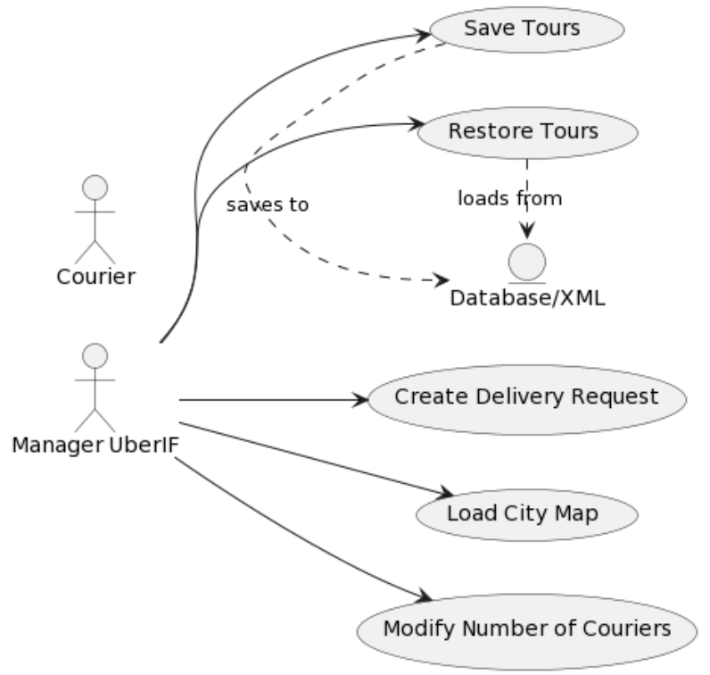
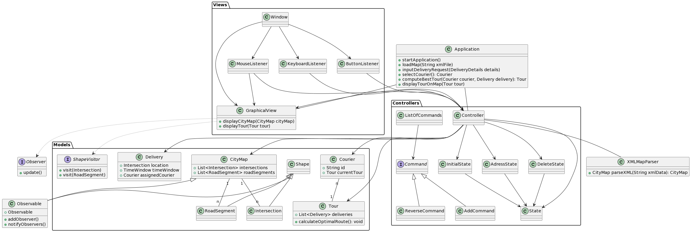

# PLD Agile: Agile Development Report

## Authors

- BECKMANN Mark, Back-End developper _Product owner_
- GUILLOT Evann, Back-End developper
- MARTIN Noham, Back-End developper
- MOREL Tim, Front-End developper
- ROULIER Marie, Full-Stack developper _Scrum master_
- WARIN Hugo, Full-Stack developper
- HADDAD Zyad, Front-End developper

## Working Group

- Group: H4132
- Department: Computer Science
- University: INSA Lyon


## Table of Contents

1. [Introduction](#introduction)
2. [First Iteration Report](#first-iteration-report)
   - [Use Case Diagram](#use-case-diagram)
   - [Main Success Scenario Description](#main-success-scenario-description)
   - [Description of All Use Cases](#description-of-all-use-cases)
   - [Class and Package Diagrams](#class-and-package-diagram)
   - [Sprint Planning](#sprint-planning)
3. [Important for next iterations](#important-for-next-iterations)
   - [MVC Architecture](#architecture-choice)
   - [Unit Testing with JUnit](#unit-testing-with-junit)
4. [Glossary](#glossary)

## Introduction

This report documents the development process of the PLD Agile project, focusing on delivering an application for optimizing delivery tours in cities using bicycles. The report adheres to Agile and SCRUM methods, emphasizing iterative development, team collaboration, and adaptability.

Agile development emphasizes flexibility, iterative progress, and collaboration. We incorporate these principles into our project through regular team meetings, SCRUM roles, and adaptability in task allocation.

## First Iteration Report


### Use Case Diagram


By Manager UberIF, we mean the user that get incoming delivery requests, calculates routes from the warehouse and that manages the couriers.

### Main Success Scenario Description


| USE CASE                  | Main Success Scenario                                                                                     |
|---------------------------|-----------------------------------------------------------------------------------------------------------|
| Create Delivery Request   | 1. Manager logs into the system<br>2. Manager selects the option to create a new delivery request<br>3. System displays the form to enter necessary details (courier, time window, destination address)<br>4. Manager fills in the form and submits it<br>5. System checks and validates data<br>6. System creates the delivery request<br>7. System initiates the process of finding an available courier and computing the best tour <br>8. System displays the map with the best tour for delivery |
| Load City Map             | 1. Manager logs into the system<br>2. Manager selects the option to load the city map<br>3. System gets all the necessary information from an XML file<br>4. System confirms successful loading of the map                                 |
| Modify Number of Couriers | 1. Manager logs into the system<br>2. Manager clicks on “+” or “-” to modify the number of available couriers<br>3. System adjusts the number of couriers                                                             |
| Save Tours                | 1. Manager logs into the system<br>2. Manager clicks on saving the tours running at the moment<br>3. System saves tours details to an XML file<br>4. System acknowledges successful saving of the tour                                       |
| Restore Tours             | 1. Manager logs into the system<br>2. Manager clicks on restoring the tours<br>3. Manager chooses the tours they want to restore<br>4. System retrieves and displays the selected tour details                                        |


### Description of All Use Cases


| USE CASE                  | DESCRIPTION                                                                                               |
|---------------------------|-----------------------------------------------------------------------------------------------------------|
| Create Delivery Request   | Allows the manager to create a new request and input details of the delivery. The manager has to select a courier, a 1-hour time window, and the destination intersection. This will enable the computing of the best tour by the computer. Then, the departure and arrival times, as well as the tour, are displayed. For now, to create a delivery request the Manager UberIF has to click on the intersections to add them to a tour. The form will be implemented in the next iteration. To be further improved.      |
| Load City Map             | Display the map of the chosen city on the screen. The map is responsive, as the entire application. Has been implemented.     |
| Modify Number of Couriers | Modify the number of active couriers in the system. Has been implemented.     |
| Save Tours               | Store in a file all the tours done in the city, as well as the departure and arrival time, corresponding courier, and the destination address. Analyzed, not implemented yet.      |
| Restore Tours             | Retrieve and load from file old tours and corresponding information, departure and arrival time as well as destination address, and display them. Analyzed but not implemented yet.      |


### Class and Package Diagram

- **Class and Package Diagram**:\


### Sprint Planning

For a sprint planning for a team of seven members over four sessions, focusing on the inception phase of your project, it's important to allocate tasks effectively to meet all deliverables. Here's a suggested sprint plan:

#### Sprint Duration:

4 Sessions with 4 hours per session

#### Session Breakdown and Task Allocation:

##### Session 1:

- **All Members**: Setting up project environment for development and conception. - 2 hours per member
- **All Members**: Brainstorming session for identifying main use cases and initial architecture. - 1 hour per member
- **Tim**: Start working on the Glossary. - 1 hour
- **Marie & Noham**: Use Case Diagram. - 1 hour
- **Mark & Hugo**: Sequence and Class Diagramm - 1 hour
- **Evann**: Architecture conception - 1 hour
- **Zyad**: Sick

##### Session 2:

- **All members**: Daily disucussion on where everybody is at. Synthesis of 1st session results. - 30 min
- **Evann & Hugo**: Continuation of architecture conception. - 3h
- **Marie and Noham**: Structured description of selected use cases. -1,5h
- **Noham**:  Joined Mark to work on algorithms. - 1,5h
- **Tim & Zyad**: Conception of UX/UI. -3h
- **Marie**: Joined the front end team to design and program thge UI. - 1,5h
- **Mark**: Research on algorithms and look at given code for TSP. - 3h
- **All Members**: Recapitulative Discussion. - 30 min

##### Session 3:

- **All members**: Daily disucussion on where everybody is at. Synthesis of 1st session results. - 30 min
- **All members**: Revisited packages, validation and implementation of packages and classes. - 2h
- **Mark & Hugo & Noham & Evann**: Continued work on algorithms. - 1,5h
- **Marie & Tim**: Front End Development - Correcttion of bugs related to displaying and the UI. - 1,5h
- **Hugo & Evann**: Debugging Git. - 1h
- **All Members**: Recapitulative Discussion. - 10 min

##### Session 4:

- **All members**: Daily disucussion on where everybody is at. Synthesis of 1st session results. - 30 min
- **Noham & Evann**: Debugging backend. - 1,5h
- **Hugo & Zyad & Tim**: Front End Debugging and background improving. - 1,5h
- **All Members**: Class meeting. - 2,5h
- **Marie & Mark**: Developing deliverables. - 1,5h

##### Outside Sessions work:

- **Tim**: Development of V1 XML parser. - 2h
- **Marie**: Development of map for UI. - 3h
- **All Members**: Backend development and Code Cleaning. - 5h per member

## Important for next iterations

We chose to take some more advanced decisions when it comes to architecture and design patterns in the first iteration of our project in order to start developing clean code with the right structure when it comes to packages, pattens and classes. The following part wil discuss the decisions we took for this. When it comes to architecture, packages, patterns and classes, you can have a look at them in our Package and Class diagram.

### Architecture choice

The application employs the Model-View-Controller (MVC) architecture, providing several advantages:

- **Separation of Concerns**: MVC divides the application into three main components—Model, View, and Controller—facilitating ease of maintenance and code evolution.
- **Ease of Maintenance**: Developers can work on individual components without affecting others. For example, UI design changes do not impact business logic.
- **Parallel Development**: Teams can work simultaneously on different components, accelerating development.
- **Code Reusability**: Models can often be reused across different views, and views with different controllers.
- **Ease of Testing**: Clear separation simplifies unit testing and debugging. Components can be tested independently.
- **Data Presentation Flexibility**: The separation allows the same data to be presented in different ways, useful for applications requiring diverse UIs.
- **Adaptability and Scalability**: MVC provides flexibility to evolve and adapt the application to changing needs without a complete overhaul.
- **Complex Interaction Handling**: Efficient management of complex interactions between UI and business logic, crucial for modern web applications.

### Unit Testing with JUnit

For unit testing, we will use JUnit, Mockito, and JFixture. Here is a simplified example of a unit test in Java using JFixture for test data generation and Mockito for mocking dependencies:

Here is an example for the classes:
```java

public class UserService {
    private UserRepository userRepository;

    public UserService(UserRepository userRepository) {
        this.userRepository = userRepository;
    }

    public User getUserById(String userId) {
        return userRepository.findById(userId);
    }
}

public interface UserRepository {
    User findById(String userId);
}

public class User {
    private String id;
    private String name;
    // Getters, setters, etc.
}

```

Here is an example of unitary tests:

``` java
    import static org.mockito.Mockito.*;
import static org.junit.Assert.*;
import org.junit.Before;
import org.junit.Test;
import com.flextrade.jfixture.JFixture;

public class UserServiceTest {

    private UserRepository userRepositoryMock;
    private UserService userService;
    private JFixture fixture;
    private String userId;
    private User expectedUser;

    @Before
    public void setUp() {
        // Création d'un mock pour UserRepository
        userRepositoryMock = mock(UserRepository.class);
        
        // Initialisation de UserService avec le mock
        userService = new UserService(userRepositoryMock);

        // Initialisation de JFixture pour la génération de données
        fixture = new JFixture();
        
        // Création d'un ID utilisateur et d'un objet User
        userId = fixture.create(String.class);
        expectedUser = fixture.create(User.class);
        
        // Configuration du comportement du mock
        when(userRepositoryMock.findById(userId)).thenReturn(expectedUser);
    }

    @Test
    public void getUserById_ShouldReturnUser() {
        // Action: Appel de la méthode à tester
        User result = userService.getUserById(userId);

        // Vérification: Le résultat doit correspondre à l'objet User attendu
        assertEquals(expectedUser, result);

        // Vérification que le mock a été appelé comme prévu
        verify(userRepositoryMock).findById(userId);
    }
}
```

In this example, JFixture is used for automatic instance creation, and Mockito for mocking UserRepository and configuring its behavior. The test verifies that `userService.getUserById` returns the expected User object and that the mock repository is called correctly.


## Glossary

1. **_Application_**: The software system designed for optimizing delivery tours in cities using bicycles.
2. **_City Map_**: A digital representation of a city's layout, including intersections and road segments, used for planning delivery tours.
3. **_Intersection_**: A point where two or more roads meet in the city map, characterized by its geographical coordinates : latitude and longitude.
4. **_Latitude:_** The geographic coordinate that specifies the north-south position of a point on the Earth's surface.
5. **_Longitude:_** The geographic coordinate that specifies the east-west position of a point on the Earth's surface.
6. **_Road Segment_**: A stretch of road connecting two intersections, with attributes like origin, destination, name, and length.
7. **_XML File_**: A file format used to describe the city map, including details of intersections, road segments, and the warehouse address.
8. **_Warehouse:_** The starting and ending point for courier tours, where deliveries are dispatched from.
9. **_Courier:_** An individual responsible for carrying out deliveries on a bicycle.
10. **_Delivery Request:_** An order for goods to be delivered to a specific location within a designated time-window.
11. **_Time-Window:_** A specified duration, here, one hour, within which a delivery must be made. Starts at fixed hours in the morning (8, 9, 10, or 11 a.m.).
12. **_Tour:_** A sequence of deliveries assigned to a courier, including start and end times, delivery locations, and time-windows.
13. **_Tour Optimization:_** The process of determining the most efficient route for a courier to complete all assigned deliveries within their time-windows.
14. **_Address:_** The specific location for a delivery, typically including details like street name, number, city, and sometimes latitude and longitude coordinates.
15. **_Travel Speed:_** The assumed constant speed of the couriers, used for calculating tour durations and feasibility.
16. **_Delivery Performance Time:_** The time taken to perform a delivery, assumed to be a constant (e.g., five minutes).
17. **_User:_** The person operating the application, responsible for loading maps, inputting delivery requests, and managing couriers.
18. **_Manager UberIF:_** The user that get incoming delivery requests, calculates routes from the warehouse and that manages the couriers.
